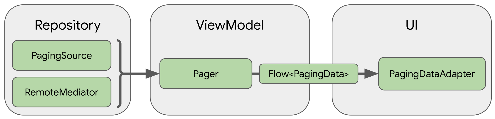

## Android Jetpack 组件


| Foundation        | Architecture | Behavior         | UI                      |
| ----------------- | ------------ | ---------------- | ----------------------- |
| Android KTX       | DataBinding  | CameraX          | Animation & transitions |
| AppCompat         | Lifecycles   | Media & playback | Emoji                   |
| Car               | LiveData     | Notifications    | Fragment                |
| Benchmark         | Navigation   | Permissions      | Layout                  |
| MultiDex          | Paging       | Preferences      | Palette                 |
| Security          | Room         | Sharing          | ViewPager2              |
| Test              | ViewModel    | Slices           | WebView                 |
| TV                | WorkManager  | -                | -                       |
| Wear OS by Google | -            | -                | -                       |


```
版本说明:
- alpha:内测版
- beta :公测版
- rc   :候选版本，和发布版本一致
- stable:稳定版本
```


---

### 架构

#### Lifecycle


---

#### Room

[Room详细](./about_room/Room.md)


---

#### Paging3

[Paging3详细](./about_paging3/Paging3.md)




---

#### Hilt

[官方文档](https://developer.android.com/training/dependency-injection/hilt-android)

[Hilt详细](./about_hilt/Hilt.md)


---

#### LiveData

[LiveData](./arch_livedata/LiveData.md)


---

#### ViewModel

[ViewModel](./arch_viewmodel/ViewModel.md)


---

### WorkManager

[codelab](https://codelabs.developers.google.com/codelabs/android-workmanager/#0)

---


---

### 界面

#### ViewPager2

---

#### MotionLayout

[MotionLayout2](./ui_motionlayout/MotionLayout.md)

---

#### AutoFill

[codelab](https://codelabs.developers.google.com/codelabs/optimize-autofill/#0)

---